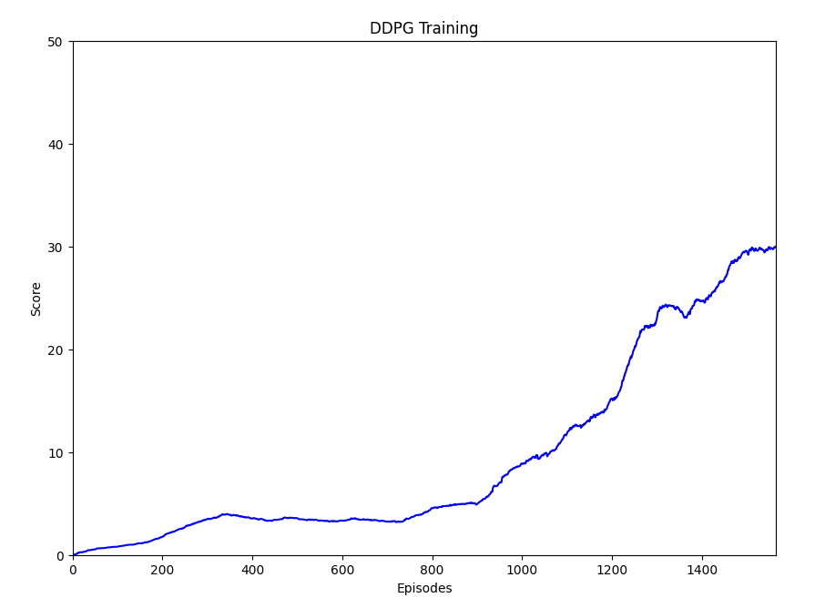

## Project Continuous Control - Report

### Deep Deterministic Policy Gradient (DDPG)
The agent was trained using DDPG which is a variant Policy Gradient methods, specifically Actor-Critic methods.
That said, DDPG can also be thought of as DQN for continuous action spaces.
The main idea is to use an Actor network to predict actions in the continuous space.
The value function is estimated by a different network called the Critic. Although Actor and Critic can share network layers,
we chose to keep them separate for simplicity.

In order to avoid temporal correlation between sampled states, we use a replay buffer 
from which we sample batches of experiences randomly. Another advantage of the replay buffer is the ability to reuse the experience
multiple times.

During training, we encourage exploration by using an epsilon-greedy policy for action selection.
The value of epsilon affects both the frequency of exploration and also the magnitude of noise added to the selected continuous action.
Also, to make learning more stable we separate the evaluation network from the selection network for both the Actor and the Critic.
We use soft updates to update the target network continuously.

### Network Architecture
As the actor and critic are separated, we can use different architectures, but for keeping things simple for this project
we use the same architecture for both actor and critic, except that for the actor we use a **tanh** activation to get values between -1 and 1.

We use a deep network for both actor and critic with two hidden layers:
* Input size: 33, same as state size
* First layer: fully connected of size 128, with relu activation
* Second layer: fully connected of size 64, with relu activation
* Output layer: fully connected of 4, same as action size (with tanh activation for Actor only)

### Hyper-parameters
The following hyper-parameters were used for training:

| Parameter | Value | Description |
| --------- | ----- | ----------- | 
| BUFFER_SIZE | 100000 | Maximum size of the replay buffer
| BATCH_SIZE | 256 | Size of the batch of experiences to sample from the buffer
| LEARNING_RATE | 0.002 | Learning rate for Actor and Critic optimizers
| TAU | 0.001 | Coefficient for soft update of network weights
| GAMMA | 0.99 | Future rewards discounting
| FC1_UNITS | 128 | Size of first fully connected layer
| FC2_UNITS | 64 | Size of second fully connected layer
| UPDATE_EVERY | 10 | Frequency for training, skipping similar consecutive states
| EPS_INIT | 1.0 | Initial value for random exploration
| EPS_DECAY | 0.9999 | Multiplicative decay
| EPS_MIN | 0.001 | Minimum value for random exploration

### Results
We consider the problem solved when the agent reaches an average score over 30 for the last 100 episodes.
The agent was able to solve the environment in 1565 episodes as shown in the following figure (plot of the running average of the last 100 episodes):

### Ideas for improvement

Solving the problem with only one agent took relatively much time. In order to accelerate learning, we can use the second version 
of the reacher environment which has 20 agents running at the same time. We can also add multiprocessing with parallel workers to collect
samples in a more efficient manner. Otherwise, in order to improve the quality of the learning, we should probably use different hyperparameters and
may be even different network architectures for the actor and the critic. Also, the experiences are sampled randomly from the replay buffer, so
Prioritized experience replay should help to improve that. Finally, PPO is now very famous and stable method for learning, so we should also give it a try on this problem.